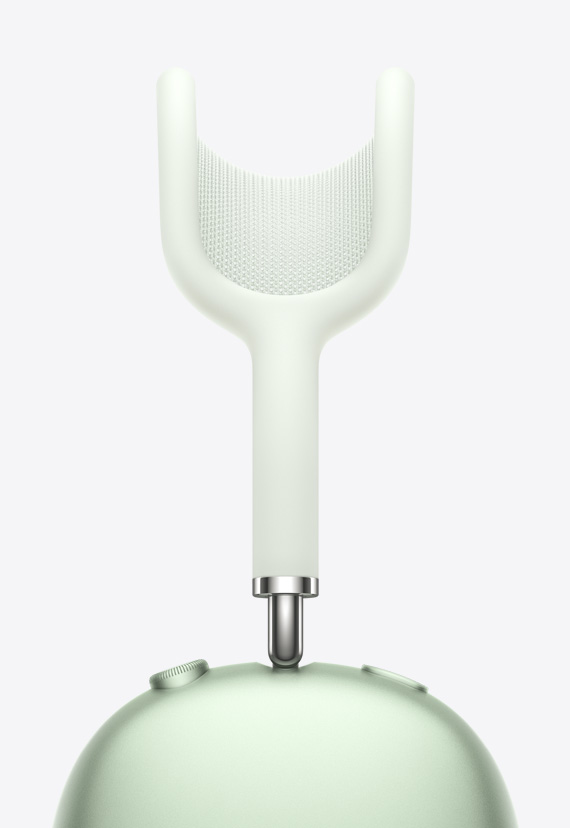

# AIRPODS MAX
> airpods max 공식 홈페이지를 클론 코딩한 pc버전 웹사이트 입니다.<br>
> 언어는 html, css, jquery를 사용하였고 모션효과는 gsap 라이브러리를 사용하였습니다.


# 이슈사항
1. 스크롤을 일정량이상 내리면 header를 scrollTop에 고정
2. 버튼하나로 slide / fade 기능 동시에 구현

# 해결방안
**1. 스크롤을 일정량 상 내리면 header를 scrollTop에 고정**
- heade의 기본 position은 relative
- 스크롤이 일정량 이상 내려가면 position을 fixed로 변경해서 top: 0;으로 상단에 고정
```html
        <div class="sticky">  =>  상단에 고정시킬 header
            <div class="align">
                <h1>AirPods Max</h1>
                <div class="box">
                    <span>개요</span>
                    <a href="">제품 사양</a>
                    <a href="">비교하기</a>
                    <a href="">구입하기</a>
                </div>
            </div>
        </div>
```
```css
        .sticky{ position: relative; width: 996px; margin: 0 auto; border-bottom: 1px solid rgba(0,0,0,.2); background-color: rgba(255,255,255,.7); backdrop-filter: blur(10px); z-index: 1; }
         =>  기본포지션은 relative
        .sticky.on{ position: fixed; top: 0; left: 50%; transform: translateX(-50%); width: 100%; }  =>  스크롤이 일정량이상 내려가면 addClass로 fixed로 변경
```
```javascript
        $(window).scroll(function(){
            let w_top = $(this).scrollTop()  =>  스크롤값을 변수로 가져옴

            if(w_top>44){
                $('.sticky').addClass('on')  =>  스크롤이 44이상 내려가면 header에 addClass('on')
            }else{
                $('.sticky').removeClass('on')
            }
        })
```
**2. 버튼하나로 slide / fade 기능 동시에 구현**
- addClass / removeClass로 a태그 클릭효과 구현
- slide, fade 슬라이드를 만들어서 id값 설정 => 버튼역할을 하는 a태그 href 주소로받아옴
- a태그의 href주소를 변수로 가져와서 주소에 해당하는 위치로 이동하게끔 구현
```html
                <ul>
                    <li data-index='0'>  =>  슬라이드가 움직여야할 위치를 알려주기위한 data-index
                        <a href="#white" class="on">  =>  버튼역할을 할 a태그
                            <div class="white">
                                <span></span>
                                <span></span>
                            </div>
                        </a>
                    </li>
                    <li data-index='1'>
                        <a href="#black">
                            <div class="black">
                                <span></span>
                                <span></span>
                            </div>
                        </a>
                    </li>
                    <li data-index='2'>
                        <a href="#blue">
                            <div class="blue">
                                <span></span>
                                <span></span>
                            </div>
                        </a>
                    </li>
                    <li data-index='3'>
                        <a href="#red">
                            <div class="red">
                                <span></span>
                                <span></span>
                            </div>
                        </a>
                    </li>
                    <li data-index='4'>
                        <a href="#green">
                            <div class="green">
                                <span></span>
                                <span></span>
                            </div>
                        </a>
                    </li>
                </ul>
            <div class="slidecon">
                <div class="slide">  =>  기본 슬라이드 (siema.js 사용)
                    
                    
                    
                    
                    
                </div>
                <div class="fade">  =>  fade 슬라이드 (css, jquery로 구현)
                    
                    
                    
                    
                    
                </div>
            </div>
```
```javascript

    // siema.js  =>  siema.js를 다운받아 html에서 연결해야 사용가능
    let sec6_slide = new Siema({
        selector: '.sec6 .slidecon .slide',  =>  슬라이드 기능이 필요한 요소(다른 slide 라이브러리들과는 달리 -webkit-box나 position: absolute같은 css가 필요없다.
        draggable: false,  =>  마우스로 드래그못하게
        duration: 500,  =>  슬라이드 한 번에 0.5초
    })
    
    $('.sec6 .btncon ul li').click(function(){
        let idx = $(this).index()  =>  버튼의 data-index를 변수로 가져옴
        sec6_slide.goTo(idx)  =>  siema.js의 이동 슬라이드 문법 작성
    })
    
    // fade 슬라이드
    $('.sec6 .btncon ul li a').click(function(e){
        e.preventDefault()  =>  태그의 고유기능 지워주기
        $(this).addClass('on').parent().siblings().children().removeClass('on')  =>  클릭한 요소는 addClass, 나머지 형제 요소들은 removeClass
        
        let add = $(this).attr('href')  =>  a태그의 href 주소를 변수로 가져옴
        $(add).addClass('on').siblings().removeClass('on')  =>  해당주소를 id값으로 가지고있는 요소에게 addClass, 나머지는 removeClass
    })
    
```
